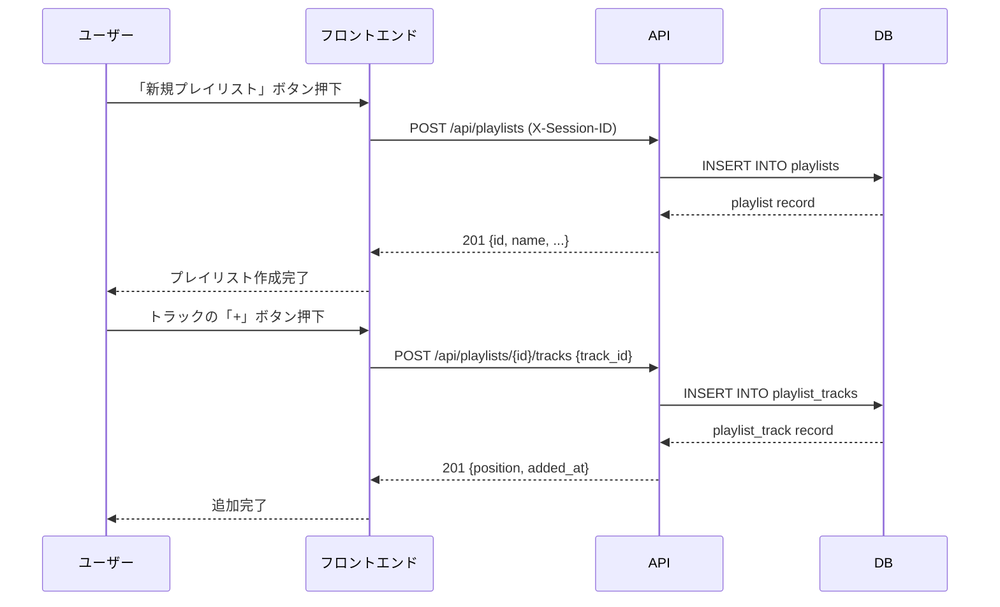
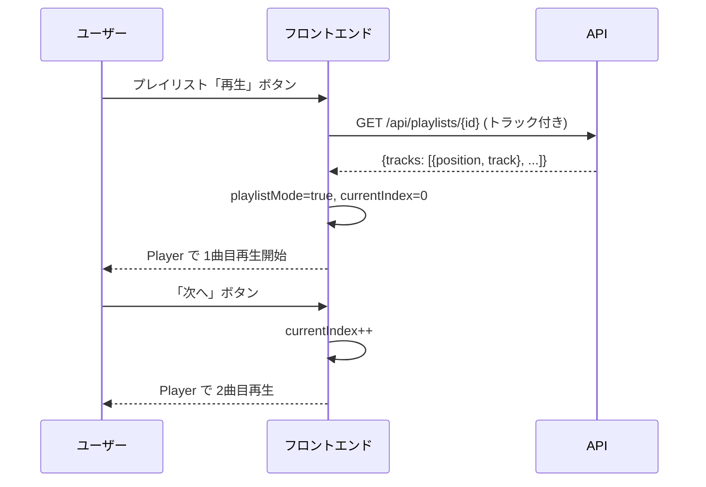

# API 仕様書 — プレイリスト機能

## 概要

既存 FastAPI アーキテクチャに準拠した REST API を追加する。
ベース URL: `/api/playlists`

---

## エンドポイント一覧

| メソッド | パス | 説明 |
|--------|------|------|
| POST | `/api/playlists` | プレイリスト作成 |
| GET | `/api/playlists` | プレイリスト一覧取得 |
| GET | `/api/playlists/{playlist_id}` | プレイリスト詳細取得 |
| PATCH | `/api/playlists/{playlist_id}` | プレイリスト更新（名前・説明） |
| DELETE | `/api/playlists/{playlist_id}` | プレイリスト削除 |
| POST | `/api/playlists/{playlist_id}/tracks` | トラック追加 |
| DELETE | `/api/playlists/{playlist_id}/tracks/{track_id}` | トラック削除 |
| PUT | `/api/playlists/{playlist_id}/tracks/reorder` | トラック順序更新 |
| GET | `/api/favorites` | お気に入りトラック一覧取得 |

---

## 共通仕様

### 認証・認可

- `X-Session-ID` ヘッダー必須（ブラウザ側で生成した UUID）
- プレイリストの所有者チェックは session_id で実施
- 不一致の場合は `403 Forbidden` を返す

### 共通エラーレスポンス

```json
{
  "detail": "エラーメッセージ"
}
```

| ステータス | 条件 |
|-----------|------|
| 400 | バリデーションエラー |
| 403 | 所有者不一致 |
| 404 | リソース不存在 |
| 409 | 重複（同一トラックの追加等） |
| 500 | サーバーエラー |

---

## POST `/api/playlists`

プレイリストを新規作成する。

### リクエストヘッダー

| ヘッダー | 必須 | 説明 |
|---------|------|------|
| X-Session-ID | Yes | セッション UUID |

### リクエストボディ

```json
{
  "name": "マイプレイリスト",
  "description": "お気に入りの曲をまとめました"
}
```

| フィールド | 型 | 必須 | バリデーション |
|-----------|-----|------|--------------|
| name | string | Yes | 1〜100文字 |
| description | string | No | 最大500文字 |

### レスポンス `201 Created`

```json
{
  "id": "uuid",
  "session_id": "uuid",
  "name": "マイプレイリスト",
  "description": "お気に入りの曲をまとめました",
  "track_count": 0,
  "created_at": "2026-03-27T00:00:00Z",
  "updated_at": "2026-03-27T00:00:00Z"
}
```

### エラー

| ステータス | 条件 |
|-----------|------|
| 400 | name が空、または文字数超過 |
| 409 | 同一 session_id・同一 name が既存 |

---

## GET `/api/playlists`

プレイリスト一覧を取得する。

### リクエストヘッダー

| ヘッダー | 必須 | 説明 |
|---------|------|------|
| X-Session-ID | Yes | セッション UUID |

### クエリパラメーター

| パラメーター | 型 | デフォルト | 説明 |
|------------|-----|-----------|------|
| limit | int | 50 | 最大取得件数（1〜50） |
| offset | int | 0 | オフセット |

### レスポンス `200 OK`

```json
{
  "playlists": [
    {
      "id": "uuid",
      "name": "マイプレイリスト",
      "description": "説明",
      "track_count": 5,
      "created_at": "2026-03-27T00:00:00Z",
      "updated_at": "2026-03-27T00:00:00Z"
    }
  ],
  "total": 3,
  "limit": 50,
  "offset": 0
}
```

---

## GET `/api/playlists/{playlist_id}`

プレイリスト詳細（トラック一覧含む）を取得する。

### リクエストヘッダー

| ヘッダー | 必須 | 説明 |
|---------|------|------|
| X-Session-ID | Yes | セッション UUID |

### レスポンス `200 OK`

```json
{
  "id": "uuid",
  "name": "マイプレイリスト",
  "description": "説明",
  "track_count": 2,
  "created_at": "2026-03-27T00:00:00Z",
  "updated_at": "2026-03-27T00:00:00Z",
  "tracks": [
    {
      "position": 0,
      "added_at": "2026-03-27T00:00:00Z",
      "track": {
        "id": "uuid",
        "title": "トラックタイトル",
        "mood": "relaxing",
        "caption": "キャプション",
        "duration_ms": 180000,
        "bpm": 90,
        "music_key": "C",
        "play_count": 42,
        "like_count": 5,
        "quality_score": 75.5,
        "channel_id": "uuid",
        "created_at": "2026-03-27T00:00:00Z"
      }
    }
  ]
}
```

### エラー

| ステータス | 条件 |
|-----------|------|
| 403 | session_id が所有者と不一致 |
| 404 | playlist_id 不存在 |

---

## PATCH `/api/playlists/{playlist_id}`

プレイリストのメタデータ（名前・説明）を更新する。

### リクエストボディ

```json
{
  "name": "新しい名前",
  "description": "新しい説明"
}
```

| フィールド | 型 | 必須 | バリデーション |
|-----------|-----|------|--------------|
| name | string | No | 1〜100文字（指定時） |
| description | string | No | 最大500文字 |

### レスポンス `200 OK`

プレイリスト詳細レスポンス（トラックなし）と同じ形式。

---

## DELETE `/api/playlists/{playlist_id}`

プレイリストを削除する（論理削除）。関連する playlist_tracks も CASCADE 削除。

### レスポンス `200 OK`

```json
{
  "ok": true,
  "deleted_tracks": 5
}
```

---

## POST `/api/playlists/{playlist_id}/tracks`

プレイリストにトラックを追加する。

### リクエストボディ

```json
{
  "track_id": "uuid"
}
```

### レスポンス `201 Created`

```json
{
  "playlist_id": "uuid",
  "track_id": "uuid",
  "position": 4,
  "added_at": "2026-03-27T00:00:00Z"
}
```

### エラー

| ステータス | 条件 |
|-----------|------|
| 404 | track_id 不存在、または retired トラック |
| 409 | 同一 playlist に同一 track_id が既存 |
| 422 | プレイリストのトラック数上限（200件）超過 |

---

## DELETE `/api/playlists/{playlist_id}/tracks/{track_id}`

プレイリストからトラックを削除する。position は自動的に詰める。

### レスポンス `200 OK`

```json
{
  "ok": true
}
```

---

## PUT `/api/playlists/{playlist_id}/tracks/reorder`

プレイリスト内のトラック順序を一括更新する。

### リクエストボディ

```json
{
  "track_ids": ["uuid-1", "uuid-2", "uuid-3"]
}
```

- `track_ids` は現在プレイリストに存在する全 track_id を含む必要がある
- 配列の順序が新しい position（0始まり）になる

### レスポンス `200 OK`

```json
{
  "ok": true
}
```

### エラー

| ステータス | 条件 |
|-----------|------|
| 400 | track_ids に存在しない track_id が含まれる、または件数不一致 |

---

## GET `/api/favorites`

現在のセッションがリアクション（like）済みのトラック一覧を取得する。

### リクエストヘッダー

| ヘッダー | 必須 | 説明 |
|---------|------|------|
| X-Session-ID | Yes | セッション UUID |

### クエリパラメーター

| パラメーター | 型 | デフォルト | 説明 |
|------------|-----|-----------|------|
| limit | int | 50 | 最大取得件数 |
| offset | int | 0 | オフセット |

### レスポンス `200 OK`

```json
{
  "tracks": [
    {
      "id": "uuid",
      "title": "トラックタイトル",
      "mood": "relaxing",
      "duration_ms": 180000,
      "bpm": 90,
      "like_count": 5,
      "quality_score": 75.5,
      "channel_id": "uuid",
      "liked_at": "2026-03-27T00:00:00Z"
    }
  ],
  "total": 12,
  "limit": 50,
  "offset": 0
}
```

---

## シーケンス図

### プレイリスト作成〜トラック追加



### プレイリスト再生


