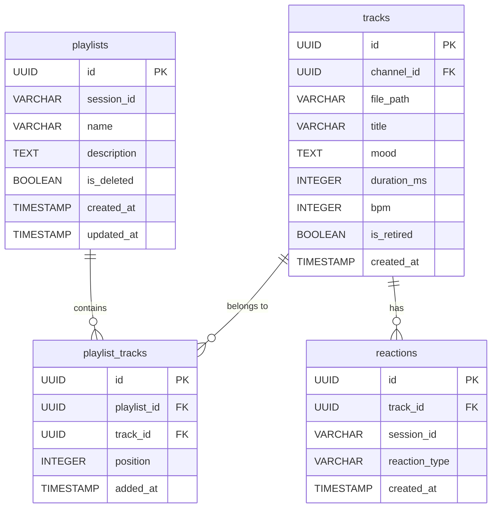

# DB スキーマ設計 — プレイリスト機能

## 概要

既存の PostgreSQL スキーマに2テーブルを追加する。既存テーブルへの変更は一切なし。

---

## 新規テーブル

### テーブル: `playlists`

ユーザーが作成したプレイリストのメタデータを管理する。

| カラム | 型 | NULL | デフォルト | 説明 |
|--------|-----|------|-----------|------|
| id | UUID | NO | gen_random_uuid() | 主キー |
| session_id | VARCHAR(64) | NO | — | 所有者セッション ID |
| name | VARCHAR(100) | NO | — | プレイリスト名 |
| description | TEXT | YES | NULL | 説明文 |
| is_deleted | BOOLEAN | NO | false | 論理削除フラグ |
| created_at | TIMESTAMP WITH TIME ZONE | NO | NOW() | 作成日時 |
| updated_at | TIMESTAMP WITH TIME ZONE | NO | NOW() | 更新日時 |

**インデックス:**

| 名前 | カラム | 種別 | 目的 |
|------|--------|------|------|
| idx_playlists_session_id | session_id, is_deleted, created_at | BTREE | セッション別一覧取得 |
| uq_playlists_session_name | (session_id, name) WHERE NOT is_deleted | UNIQUE | 同一名重複防止 |

---

### テーブル: `playlist_tracks`

プレイリストとトラックの中間テーブル。順序（position）を管理する。

| カラム | 型 | NULL | デフォルト | 説明 |
|--------|-----|------|-----------|------|
| id | UUID | NO | gen_random_uuid() | 主キー |
| playlist_id | UUID | NO | — | FK → playlists.id |
| track_id | UUID | NO | — | FK → tracks.id |
| position | INTEGER | NO | — | 再生順序（0始まり） |
| added_at | TIMESTAMP WITH TIME ZONE | NO | NOW() | 追加日時 |

**制約:**

| 名前 | 種別 | 内容 |
|------|------|------|
| uq_playlist_track | UNIQUE | (playlist_id, track_id) — 重複追加防止 |
| fk_playlist_tracks_playlist | FOREIGN KEY | playlist_id → playlists.id ON DELETE CASCADE |
| fk_playlist_tracks_track | FOREIGN KEY | track_id → tracks.id ON DELETE RESTRICT |
| chk_position_non_negative | CHECK | position >= 0 |

**インデックス:**

| 名前 | カラム | 種別 | 目的 |
|------|--------|------|------|
| idx_playlist_tracks_playlist | playlist_id, position | BTREE | 順序取得（メインクエリ） |
| idx_playlist_tracks_track | track_id | BTREE | トラック削除時の参照確認 |

---

## ER 図



---

## Alembic マイグレーション方針

**マイグレーションファイル:** `alembic/versions/009_playlist_feature.py`

```python
# 概要（実装は BE エンジニアが担当）
def upgrade():
    # 1. playlists テーブル作成
    op.create_table('playlists', ...)

    # 2. playlist_tracks テーブル作成
    op.create_table('playlist_tracks', ...)

    # 3. インデックス作成
    op.create_index('idx_playlists_session_id', ...)
    op.create_index('idx_playlist_tracks_playlist', ...)

def downgrade():
    # 逆順で削除（ロールバック対応）
    op.drop_table('playlist_tracks')
    op.drop_table('playlists')
```

**注意事項:**
- 既存テーブル（channels, tracks, requests, reactions 等）への変更は一切なし
- downgrade() を必ず実装してロールバック可能にすること
- マイグレーション番号は `009_` から開始（最新は `008_add_channels.py`）

---

## SQLAlchemy モデル（worker/models.py への追加）

```python
class Playlist(Base):
    __tablename__ = "playlists"

    id: Mapped[UUID] = mapped_column(primary_key=True, default=uuid4)
    session_id: Mapped[str] = mapped_column(String(64), nullable=False, index=True)
    name: Mapped[str] = mapped_column(String(100), nullable=False)
    description: Mapped[Optional[str]] = mapped_column(Text, nullable=True)
    is_deleted: Mapped[bool] = mapped_column(Boolean, default=False)
    created_at: Mapped[datetime] = mapped_column(TIMESTAMP(timezone=True), default=func.now())
    updated_at: Mapped[datetime] = mapped_column(TIMESTAMP(timezone=True), default=func.now(), onupdate=func.now())

    # Relationships
    playlist_tracks: Mapped[list["PlaylistTrack"]] = relationship(
        back_populates="playlist",
        cascade="all, delete-orphan",
        order_by="PlaylistTrack.position"
    )


class PlaylistTrack(Base):
    __tablename__ = "playlist_tracks"

    id: Mapped[UUID] = mapped_column(primary_key=True, default=uuid4)
    playlist_id: Mapped[UUID] = mapped_column(ForeignKey("playlists.id", ondelete="CASCADE"))
    track_id: Mapped[UUID] = mapped_column(ForeignKey("tracks.id", ondelete="RESTRICT"))
    position: Mapped[int] = mapped_column(Integer, nullable=False)
    added_at: Mapped[datetime] = mapped_column(TIMESTAMP(timezone=True), default=func.now())

    # Relationships
    playlist: Mapped["Playlist"] = relationship(back_populates="playlist_tracks")
    track: Mapped["Track"] = relationship()

    __table_args__ = (
        UniqueConstraint("playlist_id", "track_id", name="uq_playlist_track"),
        CheckConstraint("position >= 0", name="chk_position_non_negative"),
    )
```

---

## データ量見積もり

| テーブル | 想定最大レコード数 | レコードサイズ（概算） | 備考 |
|--------|-------------------|---------------------|------|
| playlists | 10,000 | ~300 bytes | 1000ユーザー × 10プレイリスト |
| playlist_tracks | 200,000 | ~100 bytes | 10,000プレイリスト × 20トラック平均 |

合計ストレージ: ~23MB（インデックス込み50MB以下）— 既存データと比較して微小。

---

## パフォーマンス考慮

1. **セッション別一覧取得** (`idx_playlists_session_id`): WHERE session_id = ? AND is_deleted = false → インデックス使用で O(log n)
2. **プレイリスト詳細取得**: playlist_id で JOIN → `idx_playlist_tracks_playlist` で O(log n + k)（k=トラック数）
3. **並べ替え**: バルクアップデート（単一トランザクション）でポジション全件更新 → トラック200件でも < 50ms
4. **お気に入り一覧**: 既存 `reactions` テーブルへの SELECT（session_id, reaction_type="like"）→ 既存テーブルにインデックス追加不要（データ量が少ない）
